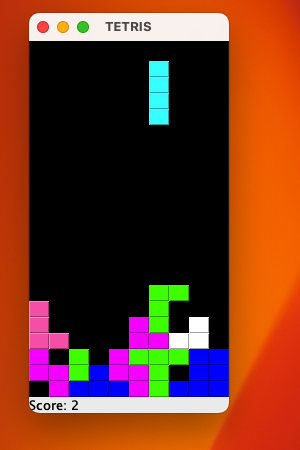

# TETRIS Video Game

This repository contains a Java-based implementation of the classic Tetris game. Designed with simplicity and educational purposes in mind, it showcases basic game development concepts in Java, including GUI creation with Swing, event handling, and object-oriented programming principles.

## Installation

To run the Tetris game, you need to have Java installed on your system. This game has been tested on Java SE 11, but it should be compatible with other versions as well.

## Steps to Run the Game

1. **Clone the repository**

   ```bash
   git clone https://github.com/your-username/TETRIS.git
   cd TETRIS
   ```
2. **Compile the Java files :**
   Ensure you are in the project root directory and compile the source code using: 

   ```bash
   javac -d out -sourcepath src src/Tetris/*.java
   ```   
3. **Create the JAR file :** From the project root directory, execute:
    
    ```bash
   jar cvfm TETRIS.jar Manifest.txt -C out/ .
   ``` 

 4. **Run the game:** Once the JAR file is created, you can run the game with:  
    ```bash
     java -jar TETRIS.jar
     ``` 

**Or you can open the JAR file directly**

## Features

This Java Tetris game brings the classic puzzle experience to your desktop with a simple and intuitive interface. Key features include:

- **Classic Tetris Gameplay**: Enjoy the timeless puzzle game. The objective is to rotate and place falling shapes to complete horizontal lines, which then disappear.
- **Score Tracking**: Keep track of your performance with an on-screen score display. The more lines you clear at once, the higher your score!
- **Game Pause/Resume**: Easily pause your game with a single keypress and resume whenever you're ready, making it convenient for short breaks.

## How to Play

Dive into the game with easy-to-learn controls:

- **Left/Right Arrow Keys**: Move the pieces left or right.
- **Up/Down Arrow Key**: Rotate the piece clockwise.
- **Spacebar**: Instantly drop the piece to the bottom.
- **P Key**: Pause and resume the game.

## Preview



## Contributing

Contributions to enhance this project are welcomed. Please feel free to fork the repository, make changes, and submit pull requests.

## License

TETRIS is open source and available under the [MIT License](LICENSE).


## Acknowledgments

- Special thanks to all contributors who have helped to improve the game.
- Inspired by the original Tetris game designed and programmed by Alexey Pajitnov.

## Connect with Me

Feel free to reach out and connect with me on [LinkedIn](https://www.linkedin.com/in/sherwinvishesh) or [Instagram](https://www.instagram.com/sherwinvishesh/).

---

Made with ❤️ by Sherwin

